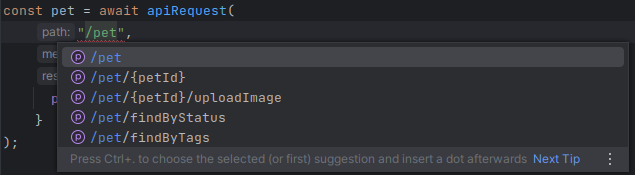
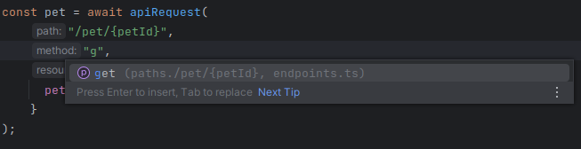
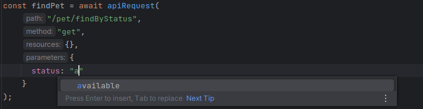
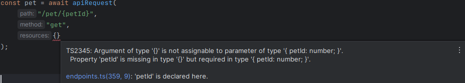
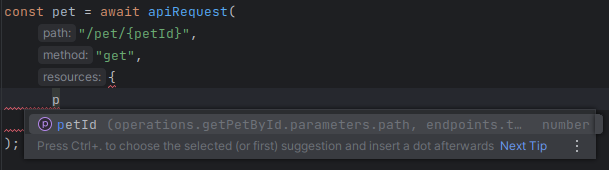

# Nuxt 3 OpenAPI Autocomplete

For all those who are a little autistic and who wish to use auto-completion according to the file generated using the [openapi-typescript](https://www.npmjs.com/package/openapi-typescript) library.

This [wrapper](api/client.ts) is built around [useFetch](https://nuxt.com/docs/api/composables/use-fetch) but can easily be adapted to any other HTTP library.

For authentication, I use an HTTP only cookie in my project but I imagine adding an [interceptor](https://nuxt.com/docs/api/composables/use-fetch#example) is enough for those who want to add a Bearer token, for example.







## Setup

Make sure to install the dependencies:

```bash
npm install
```

Create the .env file corresponding to your environment
```bash
cp env.dist .env.local
```

Generate schema from swagger.json file
```bash
npm generate:api
```

## Development Server

Start the development server on `http://localhost:3000`:

```bash
npm run dev
```


